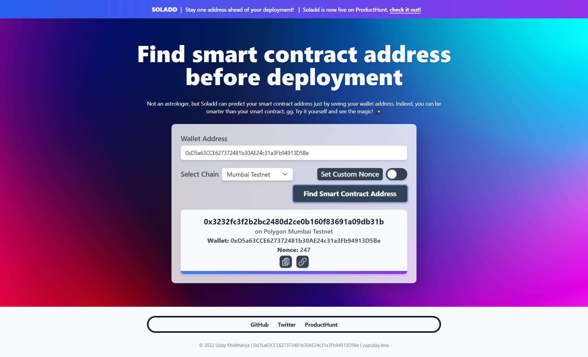

<!-- PROJECT HEADER -->

<div align="center">
  <a href="https://soladd.vercel.app/">
    
    <h1>Soladd | Find smart contract address before deployment</h1>
  </a>
  
  <p align="center">
    <a href="https://soladd.vercel.app/">View Project</a>
    |
    <a href="https://github.com/githubotoro/soladd-app/issues">Report Bug</a>
    |
    <a href="https://github.com/githubotoro/soladd-web3-app/issues">Request Feature</a>
    <br/>
    <a href="https://twitter.com/yupuday">Twitter</a>
    <br/>
    <b>If you like this project, don't forget to give it a star! <br/> Thanks! 😊</b>
  </p>
</div>



## **Soladd In A Tweet ✒️**

> Stay one address **ahead** of your smart contracts. 💯

👉 **[Soladd](https://soladd.vercel.app/)** helps you in finding the address of your smart contract before deploying it, based on just your **wallet address**.

<!-- PROJECT LINKS -->

## **Project Links 🔗**

> 📌 **[Website](https://formsify.vercel.app/) - https://formsify.vercel.app**

> 👋 **[ProductHunt](https://www.producthunt.com/posts/soladd) - https://www.producthunt.com/posts/soladd**

> 💻 **[GitHub](https://github.com/githubotoro/soladd) - https://github.com/githubotoro/soladd**

<!-- PROJECT LINKS -->

<!-- GETTING STARTED -->

## **Getting Started 🚀**

> All you need to get started with this project is an interest in **astrology** 👀

### **Installation 💻**

1.  **Clone** this repo.

    ```sh
    git clone https://github.com/githubotoro/soladd.git
    ```

2.  Get your own **API Keys** on **Ethereum, Polygon, Arbitrum, Optimism** from **[Alchemy](https://www.alchemy.com/).** Make a **.env.local** file in the root directory and enter the following line.

    ```sh
    API_KEY_NAME = "YOUR_API_KEY"
    ```

    > **NOTE: Never push your .env file to GitHub.**

3.  **Install** NPM packages.
    ```sh
    npm install
    ```
4.  **Start** the project.

    ```sh
    npm run dev
    ```

5.  **Time to predict those addresses! 🧐**

<!-- GETTING STARTED -->

<!-- CONTACT -->

## **Contact 👋**

> **Uday Khokhariya**

-   **Twitter** - [yupuday](https://twitter.com/yupuday)
-   **Email** - uday.khokhariya@gmail.com

<!-- CONTACT -->
